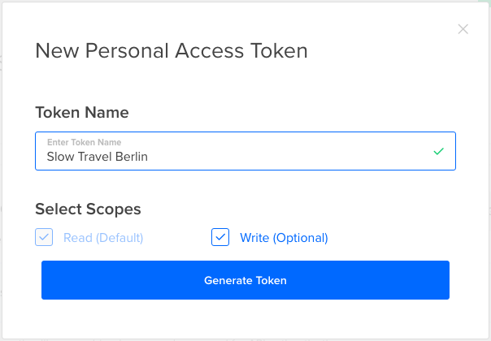

# STB Deployment


This document covers deploying the site to an ISP.
For information on how to configure a deployed site,
see the [CONFIGURATION](CONFIGURATION.md) page.

## Prerequisites

This guide assumes you are on a Unix or Unix-like
OS. It was originally written on a Mac, but Linux
or similar should work directly. This would also
work on Windows, but some of the commands will
likely differ, and there may be additional work
to get things working.

This guide assumes that you have
[Docker](https://www.docker.com/products/docker)
installed. Docker allows us to define how the
infrastructure is deployed, and how services
relate to each other. As a result, we can
deploy identically across various hosting
providers with very little effort. Sweet!

For the purposes of this guide, we'll be
deploying to
[Digital Ocean](https://www.digitalocean.com).
It's performant and cheap, a great combination.
Head on over there and make an account. If there's
some reason to not use Digital Ocean, we can
update the guide to reflect our preferred
deployment environment.


## Deploying

Finally, to the heart of the matter. First and
foremost, get ahold of the source code for
this repository on your local machine.

Assuming you are reading this on GitHub, you
can do this by going to the main page of the
repository and clicking the green button that
says "Clone or Download". Chose the option
that works best for you - if you are comfortable
with git feel free to clone, if not just
download a zip archive, decompress it, and
cd into the directory.

### Getting a Digital Ocean API Key

Log into your Digital Ocean account, and click
API in the top menu. Then click "Generate New
Token".


Give the key a name, and ensure the "write" option
is checked. Now hit "Generate Token"



Finally, you will see your API key on the API page,
it's the really long set of numbers and letters.


Copy that, we'll need it below.

### Provisioning Docker on the Server

Now we'll provision docker on the server so we can
push the site there. All you'll need to do is replace
`YOUR_API_KEY_HERE` in the below command, and paste
it into your terminal (note the `$` below represents
the prompt - don't coopy that). Hit enter and it
will handle the rest.

	$ docker-machine create \
		--driver digitalocean \
		--digitalocean-access-token YOUR_API_KEY_HERE \
		--digitalocean-image "19144036" \
		--digitalocean-region "fra1" \
		--digitalocean-size "2gb" \
		slow-travel-berlin

It will begin the process, and it will take a minute
or so. When it is done you should see `Docker is up and running!`
in your terminal.

An important note - this created a server in your
Digital Ocean account, from this point forward
monthly charges apply.

Another thing worth considering - the above command
is for use with Digital Ocean. It handles things like
sharing keys and adding necessary resources. For the
sake of completeness, here's a more generic command
you can use, assuming you have a machine set up
at `IP_ADDRESS` that has an ssh public key matching
`SSH_PRIVATE_KEY`

	$ docker-machine create \
		--driver generic \
		--generic-ip-address IP_ADDRESS \
		--generic-ssh-user root \
		--generic-ssh-key SSH_PRIVATE_KEY \
		slow-travel-berlin


But the Digital Ocean version should be enough
for our purposes.

### Deployment

Now that your server is prepped, deploying the site
is simple. First, copy the 
`docker-compose.override.yml.sample` file to
`docker-compose.override.yml` and open it in a text
editor. These will be the passwords that will be
used to connect the application to the database.
You'll want to create two passwords and keep
them in a safe place - we won't be checking
them in to the respostiory with the other
configuration information. Don't lose it!

One thing to note - the `MYSQL_PASSWORD` and the
`WORDPRESS_DB_PASSWORD` must be the same. When you
are done, it will look like this (except of
course with your own passwords):


	version: '2'
	services:
	  wordpress:
	    environment:
	      - WORDPRESS_DB_PASSWORD=REPLACE_ME_PLEASE
	  mysql:
	    environment:
	      - MYSQL_ROOT_PASSWORD=REPLACE_ME_TOO
	      - MYSQL_PASSWORD=REPLACE_ME_PLEASE


Then, bring up the MySQL server so
it is available to WordPress when it is started.

```
$ docker-compose up mysql
```

After a few minutes the database will be up and ready.
You should see something along the lines of 
`MySQL init process done. Ready for start up.` in the
output. Hit ctrl-c
You can then start the WordPress container:

```
$ docker-compose up -d
```

When that finishes, get the public ip address:

```
$ docker-machine ip slow-travel-berlin
```

If you visit this in a web browser, you should see the new
site. Head on over to our [CONFIGURATION](CONFIGURATION.md)
page for information on configuraiton.
